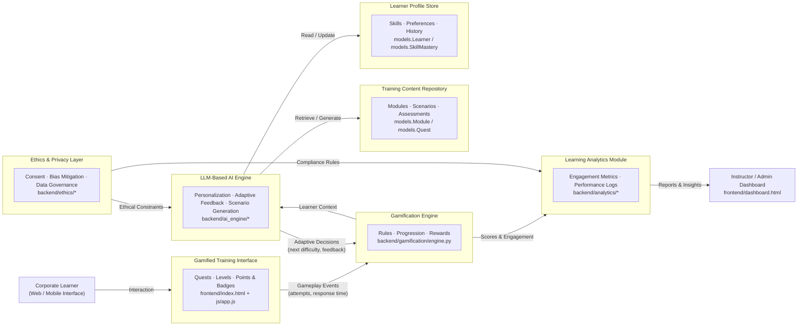
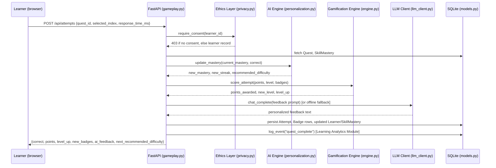
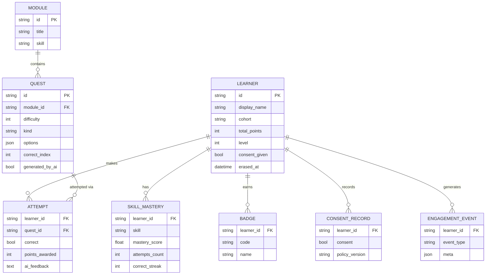

# System Architecture

This document describes the architecture of the SkillSphere prototype and
shows how it implements the conceptual architecture diagram from the thesis
proposal. Every box in the original diagram corresponds to a real,
runnable module in this repository - nothing here is purely conceptual.

## 1. High-level component diagram

This is a direct implementation of the thesis's conceptual diagram; the only
addition is explicit source-file references so the diagram is traceable to
code, which matters when this document is used as thesis evidence.

## 2. Request/response sequence for one gameplay loop

The single most important flow in the system - a learner answering a
question and the AI/gamification engines reacting - is implemented in
`backend/routers/gameplay.py::submit_attempt`. Sequence:

Note that the AI Engine and Gamification Engine are **pure, independently
testable functions** (see `tests/test_ai_engine.py`,
`tests/test_gamification.py`) - the router only orchestrates side effects
(DB writes, HTTP). This separation is what makes the adaptive logic
auditable, which matters for the ethics/fairness objective (R4): an
instructor or auditor can reason about `update_mastery()` and
`difficulty_for_mastery()` without needing to trace HTTP plumbing.

## 3. Data model (Entity-Relationship)

## 4. Component responsibilities

| Diagram box | Module(s) | Responsibility |
|---|---|---|
| Gamified Training Interface | `frontend/index.html`, `frontend/js/app.js` | Renders quests, points, level, badges; captures gameplay events (answer + response time) |
| Gamification Engine | `backend/gamification/engine.py` | Deterministic scoring, level curve, badge rules, quest progression |
| LLM-Based AI Engine | `backend/ai_engine/personalization.py`, `llm_client.py`, `scenario_generator.py` | Mastery estimation (EMA), ZPD-based difficulty recommendation, adaptive feedback generation, scenario generation |
| Ethics & Privacy Layer | `backend/ethics/privacy.py`, `bias_mitigation.py` | Consent gating, right-to-erasure, cohort fairness auditing |
| Learning Analytics Module | `backend/analytics/engagement.py`, `reporting.py` | Event logging, engagement/performance/fairness aggregation |
| Training Content Repository | `backend/models.py::Module/Quest`, `seed_data.py` | Pre-authored + AI-generated modules, scenarios, assessments |
| Learner Profile Store | `backend/models.py::Learner/SkillMastery` | Skills (mastery per skill), preferences, history |
| Instructor/Admin Dashboard | `frontend/dashboard.html`, `js/dashboard.js` | Engagement charts, fairness monitor, leaderboard |

## 5. Why FastAPI + SQLite + vanilla JS (design rationale)

- **FastAPI**: async-first, Pydantic-validated request/response schemas give
  the API a typed contract (`backend/schemas.py`) that doubles as
  machine-readable documentation (`/docs`) - useful when the prototype is
  handed to research assistants running a pilot study who are not the
  original developer.
- **SQLite**: zero-ops relational storage appropriate for a pilot-scale
  study (tens to low hundreds of learners); the SQLAlchemy layer means
  migrating to Postgres later is a one-line `DATABASE_URL` change, not a
  rewrite.
- **Vanilla JS**: no build step, no framework version drift, runs by
  opening two HTML files served as static assets - minimizes the technical
  barrier for a non-engineering thesis committee to run the demo themselves.
- **Anthropic Claude API with offline fallback**: keeps the "AI" in "AI-driven
  gamification" real (the architecture genuinely calls an LLM), while making
  the prototype's core adaptive behaviour reproducible without network
  access or API cost, which is essential for a controlled comparative study
  (R3) and for grading/demoing without exposing API keys.
